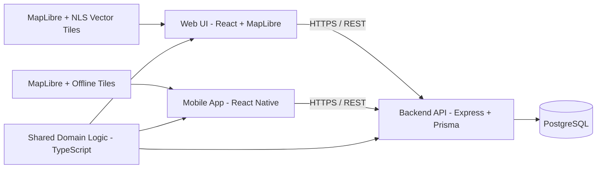
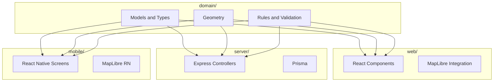

# Architecture & Technical Overview

This document describes the planned architecture for Trail Tracker: a full-stack TypeScript application for designing and navigating MEJÄ-style blood tracks.

Official rules and organizing instructions for MEJÄ form the core domain reference.

---

## High-Level System Overview



**Key ideas:**

- Single source of truth for MEJÄ rules and geometry in a shared TypeScript domain layer
- Web, mobile, and backend import the same domain code
- MapLibre renders maps in both web and mobile apps
- Backend stores tracks, rules, users, and versions

---

## Planned Repository Structure

```text
.
├─ domain/                      # Pure TS domain logic (no React or Node)
│  ├─ models/                   # Track, Segment, Corner, LayPit, etc.
│  ├─ rules/                    # Rule models and validation logic
│  ├─ geometry/                 # Distance, angles, intersection checks
│  └─ __tests__/                # Unit tests (Jest or Vitest)
│
├─ web/                         # React + MapLibre web application
│  ├─ src/
│  │  ├─ components/
│  │  ├─ features/
│  │  │  ├─ track-design/
│  │  │  └─ rule-visualization/
│  │  ├─ hooks/
│  │  ├─ pages/
│  │  └─ main.tsx
│  └─ tests/                    # Cypress E2E tests
│
├─ server/                      # Node.js + Express backend
│  ├─ src/
│  │  ├─ api/                   # REST controllers
│  │  ├─ services/              # Application logic
│  │  ├─ prisma/                # Prisma client and schema
│  │  └─ index.ts
│  └─ tests/
│
└─ mobile/                      # React Native application (later)
   ├─ app/
   └─ src/
```

---

## Domain Layer

The **domain** package is the heart of the system. It must be:

- Framework-agnostic (no React, Express, or browser APIs)
- Heavily unit-tested
- Stable and backwards-compatible once the mobile app is built

### Core Models (first iteration)

These will evolve, but initial core types may look like:

- `Track`
  - `id`, `name`, `type` (AVO | VOI | TRAINING)
  - `segments: TrackSegment[]`
  - `objects: TrackObject[]`
  - `meta: { createdAt, updatedAt, authorId, locationHint }`
- `TrackSegment`
  - `id`, `start: Coordinate`, `end: Coordinate`
  - `sequenceIndex: number`
- `TrackObject` (discriminated union)
  - `type: "LAY_PIT" | "CORNER" | "MARKER" | "FINISH" | "START" | "MAKUUPAIKKA" | "KATKOS"`
  - geometry & metadata
- `RuleSet`
  - Parameterized constraints for AVO / VOI (length ranges, min distances, etc.)
- `RuleViolation`
  - `id`, `ruleId`, `severity`, `message`, `location`, `details`

Training tracks will **not** use rule validation, but they will use all geometry and object features (lengths, segment lengths, markers, etc.).

The rule engine will:

1. Take a `Track` and a `RuleSet` (e.g., AVO or VOI as defined in MEJÄ rules).
2. Run geometry + structural checks.
3. Return a list of `RuleViolation`s + summary status.

---

## Domain-Centric Design



---

## Web Application Architecture

### Technologies

- React + TypeScript
- Vite bundler
- MapLibre GL JS for map rendering
- React Query later for backend interaction

### Initial Features

- Display NLS basemap via MapLibre
- Start new track (choose AVO, VOI, or Training)
- Draw geometry: points and lines
- Add domain-specific objects: corners, lay pits, markers, finish
- Run local validation using `domain/`
- Visualize rule violations on map

---

## Backend Architecture (later phase)

Responsibilities:

- User management
- CRUD for tracks
- Rule configuration
- Track versioning
- Multi-device sync

Tech stack:

- Node.js + Express
- Prisma ORM
- PostgreSQL or SQLite for development

---

## Mobile App (later phase)

Key design points:

- Offline-first operation
- Local caching of tracks and tiles
- GPS and orientation-based navigation
- Minimal UI focused on executing pre-designed tracks

---

## Testing Strategy

- **Domain:** Unit tests for geometry and rule validation
- **Web:** Cypress E2E + component tests
- **Server:** Integration tests for endpoints

---

## Implementation Phases

1. Scaffold repo + domain package
2. Basic web app with MapLibre
3. Track drawing and object placement
4. Rule engine basics
5. Full AVO and VOI rule support
6. Backend introduction
7. Mobile client planning and prototype
