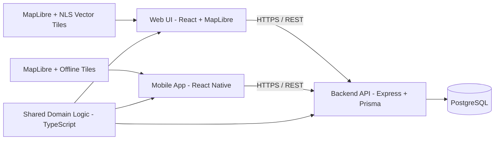
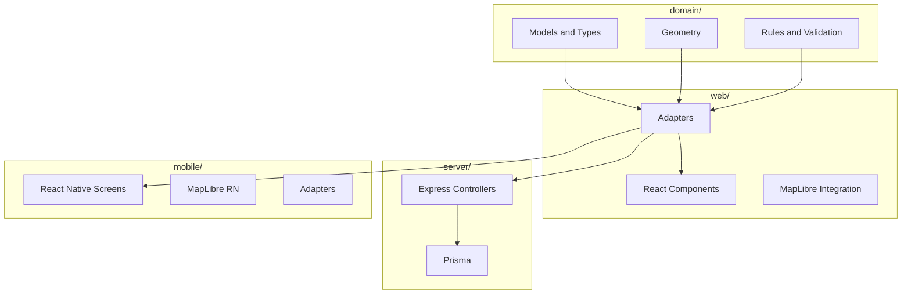

# Architecture & Technical Overview (Updated)

This document describes the planned architecture for Trail Tracker: a full-stack TypeScript application for designing and navigating MEJÄ-style blood tracks.

Official rules and organizing instructions for MEJÄ form the core domain reference.

---

## High-Level System Overview



**Key ideas:**

- Single source of truth for MEJÄ rules and geometry in a shared TypeScript domain layer
- Web, mobile, and backend import the same domain code
- MapLibre renders maps in both web and mobile apps
- Backend stores tracks, rules, users, and versions

---

## Planned Repository Structure

```text
.
├─ domain/                      # Pure TS domain logic (no React or Node)
│  ├─ models/                   # Track, Segment, Objects, etc.
│  ├─ rules/                    # Rule models and validation logic
│  ├─ geometry/                 # Distance, angles, intersection checks
│  └─ __tests__/                # Unit tests (Vitest)
│
├─ web/                         # React + MapLibre web application
│  ├─ src/
│  │  ├─ adapters/              # GeoJSON/MapLibre ↔ domain conversions
│  │  ├─ components/
│  │  ├─ features/
│  │  │  ├─ track-editor/
│  │  │  └─ rule-visualization/
│  │  ├─ hooks/
│  │  ├─ pages/
│  │  └─ main.tsx
│  └─ tests/                    # Cypress E2E tests (later)
│
├─ server/                      # Node.js + Express backend (later)
│  ├─ src/
│  │  ├─ api/                   # REST controllers
│  │  ├─ services/              # Application logic
│  │  ├─ prisma/                # Prisma client and schema
│  │  └─ index.ts
│  └─ tests/
│
└─ mobile/                      # React Native application (later)
   ├─ app/
   └─ src/
```

---

## Domain Layer

The **domain** package is the heart of the system. It must be:

- Framework-agnostic (no React, Express, or browser APIs)
- Heavily unit-tested
- Stable and backwards-compatible once the mobile app is built

### Coordinate Convention (Important)

- Domain `Coordinate` uses **WGS84 (longitude, latitude)**.
- Projection / rendering conversions (e.g., WebMercator) happen only in `web/` and `mobile/` map adapters.

This avoids subtle geometry and bearing errors.

### Core Models (first iteration)

- `Track`
  - `id`, `name`, `type` (AVO | VOI | TRAINING)
  - `segments: TrackSegment[]`
  - `objects: TrackObject[]`
  - `meta: { createdAt, updatedAt, authorId, locationHint }`
- `TrackSegment`
  - `id`, `start: Coordinate`, `end: Coordinate`
  - `sequenceIndex: number`
- `TrackObject` (discriminated union)
  - `type: "START" | "FINISH" | "CORNER" | "LAY_PIT" | "MARKER" | "BREAK"`
  - Geometry & metadata by type
- `RuleSet`
  - Parameterized constraints for AVO / VOI (length ranges, min distances, etc.)
- `RuleViolation`
  - `id`, `ruleId`, `severity`, `message`, `location`, `details`

Training tracks do **not** use MEJÄ rule validation, but they use all geometry and object features.

---

## Adapter Boundary (Make This Explicit)

To keep the domain pure and reusable:

- `domain/` must not depend on GeoJSON or MapLibre types.
- `web/` and `mobile/` convert **GeoJSON/MapLibre** ↔ **domain** via small adapter modules.

**Examples:**

- `web/src/adapters/geojson.ts`
- `web/src/adapters/coordinates.ts`

---

## Web Editor State Model

To prevent UX complexity, define an explicit editor state machine:

- `idle` – nothing drawn yet
- `drawing` – appending points
- `finished` – track defined, ready for validation/object placement
- `editing` – moving/inserting/removing points

State determines which interactions are allowed.

---

## Domain-Centric Design



---

## Backend Architecture (later phase)

Responsibilities:

- User management
- CRUD for tracks
- Rule configuration (optional; defaults can live in domain)
- Track versioning
- Multi-device sync

Tech stack:

- Node.js + Express
- Prisma ORM
- PostgreSQL (or SQLite in development)

---

## Mobile App (later phase)

Key design points:

- Offline-first operation
- Local caching of tracks and tiles
- GPS and orientation-based navigation
- Minimal UI focused on executing pre-designed tracks
- Reuse of `domain/` for geometry + validation (where relevant)

---

## Testing Strategy

- **Domain:** Unit tests for geometry and rule validation (Vitest)
- **Web:** Cypress E2E + component tests (later)
- **Server:** Integration tests for endpoints

---

## Domain Stability Contract

Once mobile development begins:

- Treat domain public APIs as stable.
- Breaking changes require versioning and/or migrations (especially for persisted tracks).

---

## Implementation Phases

1. Scaffold repo + domain package
2. Basic web app with MapLibre
3. Track drawing and object placement
4. Rule engine basics
5. Full AVO and VOI rule support
6. Backend introduction
7. Mobile client planning and prototype